# ProxyLib
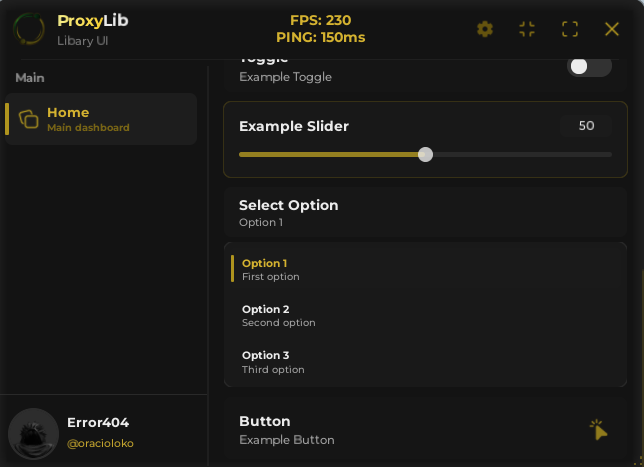
- 👋 Hello, welcome to ProxyLib. Below you can see the components.

- Separator
- Tab
- DiscordInvite
- Paragraph
- Toggle
- Slider
- Dropdown
- Button
- Notify
- Menu Config

---
- Separator
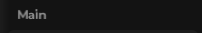

```lua
window:CreateSeparator({ Text = "" }) 
````
---
- Tab
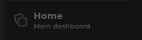

```lua
local Tab = window:CreateTab({
    Title = "", 
    Subtitle = "",
    Icon = "rbxassetid://", -- Your ID
})
```
---
- Discord Invite
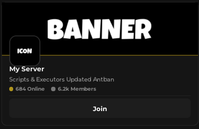

```lua
Tab:CreateDiscordInvite({
    Banner      = "rbxassetid://", -- Your ID
    Icon        = "rbxassetid://", -- Your ID
    Title       = "",
    Description = "",
    Link        = "https://discord.gg/", -- URL
    Button      = "",
})
```
---
- Paragraph
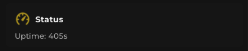

```lua
local statusP = Tab:CreateParagraph({
    Title = "",
    Icon = "rbxassetid://", -- Your ID
    Description = "",
})
```
---
- Toggle
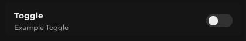

```lua
Tab:CreateBoxToggle({
    Title = "",
    Description = "",
    Default = false, -- Toggle Start Active
    Confirmation = false, -- Ask before activating
})
```
---
- Slider
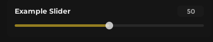

```lua
Tab:CreateSlider({
    Title = "",
    Min = 0,
    Max = 100,
    Default = 50,
    Callback = function(value)
    end,
})
```
---
- Dropdown
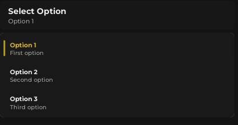

```lua
Tab:CreateDropdown({
    Title = "",
    Multiple = false, -- Active Case For Multiple Selection
    Default = { "" },
    Options = {
        { Value = "", Description = "" },
        { Value = "", Description = "" },
        { Value = "", Description = "" },
    },
})
```
---
- Button
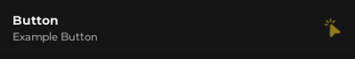

```lua
Tab:CreateButton({
    Title = "",
    Description = "",
    Confirmation = true,
    Callback = function()
    end,
})
```
---
- Textbox
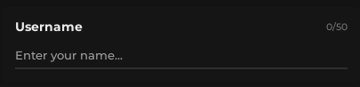
---
- Notify
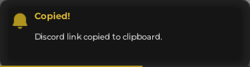

```lua
window:Notify({
    Title = "",
    Text = "",
    Icon = "rbxassetid://", -- Your ID
    Duration = 5,
})
```
---
- Config Menu
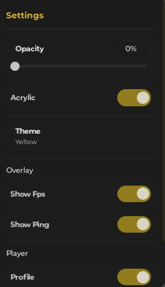

---

- Window


```lua
local ProxyLib = loadstring(game:HttpGet("https://raw.githubusercontent.com/ProxyHubDev/Proxy.Lib/refs/heads/main/Libary/main.lua"))()

local lib = ProxyLib.new()

local window = lib:CreateWindow({
    Title = "",
    Subtitle = "",
    Theme = "",
    Icon = "rbxassetid://", -- Your ID
    Size = Vector2.new(520, 380),
    MinSize = Vector2.new(380, 250),
    MaxSize = Vector2.new(900, 650),
    TitleConfig = {
        Words = { "" }, -- Words That Will Remain in Gradient
        Gradient = true, 
        Colors = { Color3.fromRGB(247, 241, 141), Color3.fromRGB(245, 205, 48) },
    },
    FloatButton = {
        Shape = "", -- Square or Circle
        Color = "", -- White or Black
        Size = 50,
        Icon = "rbxassetid://", -- Your Id
    },
    Acrylic = {
        Enabled = false,
        Opacity = 0,
    },
    ConfigPanel = {
        Enabled = true,
        Acrylic = true,
        Theme = true,
        Fps = true,
        Ping = true,
        Profile = true,
        HideNotify = true,
    },
})


---
- Thanks For Use
- Made by @zerozxk and @araujozwx
---
