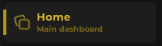

# ProxyLib

---
- Separator


```lua
window:CreateSeparator({ Text = "Name" })
````
---
- Tab


```lua
local homeTab = window:CreateTab({
    Title = "Home",
    Subtitle = "Main dashboard",
    Icon = "rbxassetid://134177068646875",
})
```

---
- Toggle


```lua
Tab:CreateBoxToggle({
    Title = "Toggle",
    Description = "Example Toggle",
    Default = false, -- Toggle Start Active
    Confirmation = false, -- Ask before activating
})
```

---

